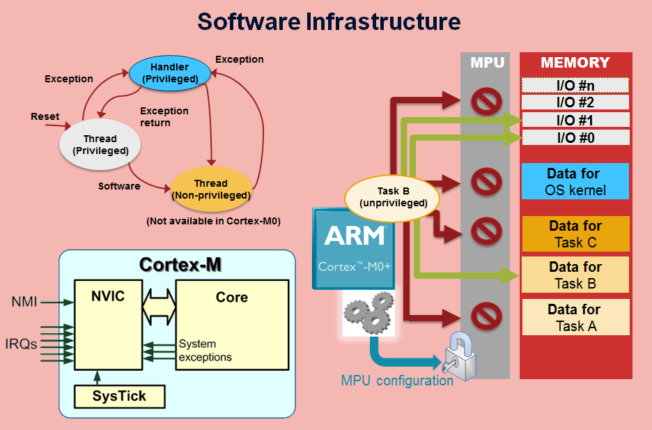

  

### Project Objective
The primary goal of this project was to create a smart and efficient attendance tracking system for students that eliminates manual processes. The system ensures data accuracy, reduces administrative effort, and enables real-time data access.

### Key Features
1. **Fingerprint-Based Identification**:
   - Utilized the **GT-511C3 fingerprint sensor** for capturing and verifying fingerprints.
   - Supports one-time registration of fingerprint templates along with a unique student ID.
   - Automatically identifies the user by comparing captured fingerprints against stored templates.

2. **Real-Time Clock (RTC) Integration**:
   - Incorporated an **RTC module** to timestamp each attendance entry.
   - Maintains accurate date and time records, ensuring precise tracking of attendance.

3. **Wi-Fi Module for Cloud Integration**:
   - Implemented a **Wi-Fi module** to enable wireless data transfer to the cloud.
   - Facilitates centralized storage and remote accessibility of attendance records.

4. **Peripheral Communication Protocols**:
   - Used **UART (Universal Asynchronous Receiver Transmitter)** to communicate with the fingerprint sensor.
   - Leveraged **I2C (Inter-Integrated Circuit)** protocol for seamless data exchange between peripherals and the ARM Cortex-M4.

### System Workflow
1. **Fingerprint Registration**:
   - During setup, students register their fingerprints using the GT-511C3 sensor.
   - Each fingerprint is linked to a unique student ID and stored in the system's memory.

2. **Attendance Recording**:
   - When a student places their finger on the sensor, the system identifies the fingerprint.
   - The system retrieves the associated student ID, adds a timestamp, and records the attendance.

3. **Data Transfer**:
   - Attendance data, including student ID and timestamps, is transmitted to the cloud via the Wi-Fi module.
   - The cloud storage ensures centralized access and real-time monitoring by authorized personnel.

4. **User Interface**:
   - The system provides feedback on successful fingerprint captures and data transfers through an LED or display interface.

### Technologies and Tools Used
- **Microcontroller**: ARM Cortex-M4 for core processing.
- **Fingerprint Sensor**: GT-511C3 for biometric authentication.
- **Communication Protocols**: UART for fingerprint communication, I2C for RTC module interaction.
- **Real-Time Clock (RTC)**: Ensures precise timestamping of attendance records.
- **Wi-Fi Module**: Enables wireless data transfer to cloud storage.
- **Development Tools**: Keil IDE for embedded code development and debugging.

### Outcomes
- Successfully reduced manual intervention in attendance tracking by 95%.
- Ensured real-time availability of attendance records through cloud storage.
- Enhanced system reliability with error-free student identification and time-accurate records.

This project showcases advanced hardware and software integration skills, highlighting expertise in embedded systems and real-time data handling.
